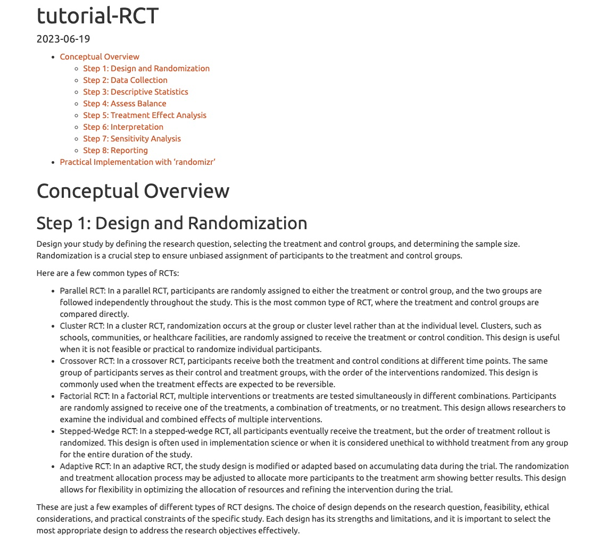

# Overview on Randomised controlled trials
## Description
Randomized Control Trials (RCTs) are a powerful research design used to evaluate the effectiveness of interventions or treatments. They involve randomly assigning participants into different groups to compare the outcomes between them. RCTs are widely used in various fields, including medicine, psychology, education, and social sciences.

## Preview

 
